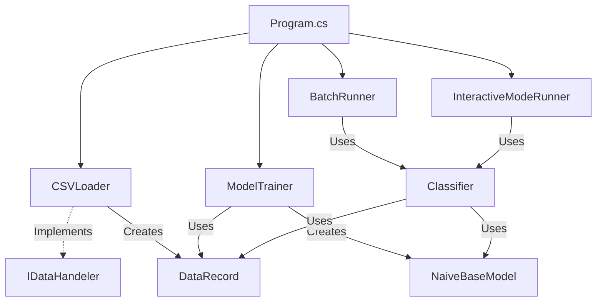

# System first Plan:

-The system need to resolve the proble that there is a lot of spam emails
and we want to get only the important emails , we need to classificate the spam
email , and build classifier model that will know to understand by training
model what every email is,

## The model;
takes CSV and build model that understand by the statistics the classification,
for example email with word "BANANA" considerd SPAM (but this is not my desicion
this is something that the model need to decide\

## Businnes rules and needs:
- To Accept csv filename as parameter 
- To accept csv filename as Input from console
- To parse the csv into Object / List / Whatever
- To Train the model (from the csv propabilities) (From exists data)
- Use the train for create model with calculations for new data without the lables
- 2 Condions , new data from the user from console  , and form full new data csv

## -Entities and services and Whatever :
- S - file handles and reader (her csv) I
- S - file parser form csv to list of obj
- S - gets the filename as input ?? 
- E - Get the statistics form the csv and caluclate according
the algorithm and saves the data (3 dicts that coantins the probability) 
- E - The model Gets new data and calculate accorifing the train the missing labels (e.g = isSpam?)
-  the output - table (list of obj) that conatins the original table 
with the additional label (e.g = isSpam?)
- Manager orchestructor

=============================
## Classes and Interfaces :

### IDataHandeler:
	-interface that knows to take data from somewhere and load it into the program

### class CSVLoader:
	-basically loads the csv , parse the details into list of obj and returns this;

### class DataRecord:
	- represent every line in the csv (Dictionary) the key is the 
	column name and the value is the cell;

### class ModelTrainer:
	- gets collection of DataRecord obj and calculate according the algorithm the statistics 
	- Then need to calculate the total file (all lines) for the requerid labels
	returns obj of the trained model (NaiveBaseModel)

### class NaiveBaseModel:
	-box that conatins the statistics for the three main dictionaries
	1. dict of the previus probability - (The simple statiscs , how may failed , how many successed)
	2. dict of the conditional probability - ()
	3. dict of the new-data to calculate (for example never seen word , gives it automatically 1
	instead of 0 , (this is the math rule)) (But this is the old data)

### class Classifier:
	-this is get the Ready NaiveBaseModel and caluculate the data
	and returns the data with the new label (e.g = isSpam = Yes)

### class InteractiveModeRunner:
	-The orchestructor of the interactive mode
	-gets the trained model , 
	- handle loop that runs until the user enterd empty list
	- ask for inout for each attriute in separated (e.g Outlock , Temp)
	and build the line and sends it to the classifier

### class BatchRunner:
	-the orchestructir of the batch mode 
	get the file path the the trained model 
	sends the classifier the data and the prepar model and add the label
	prints every line to the console and save the data in new file

### class Program.cs
	-Checks if recieved one parm or two
	- handels errors and exceptions
	- crate the mdoel trainer and give the run for the righ orchestructor
	-

## Main Flow:
	- Gets path one or two , for input and (output optional) and this sets the mode!
	- Load and parse (diffenet implementation for each mode)
	- send to the trainer the raw data
	- create object with the trained statitic model
	- classificate the line and sends it (for file or console)

## Team Work Division:
	CSVLoader - Yoni
	DataRecord - Yoni
	Classifier -- Yoni
	Program - Yoni
	CSVWriter - Yoel
	NaiveBayesModel -- Yoel
	ModelTrainer -- Yoel
	PipeLine -- Yoel

=============================
## System Dependencies:

### Dependency Table

| Component | Depends On | Description |
| :--- | :--- | :--- |
| **Program.cs** | CSVLoader, ModelTrainer, BatchRunner, InteractiveModeRunner | Main entry point, orchestrates the flow based on arguments. |
| **CSVLoader** | IDataHandeler (Implements), DataRecord | Reads CSV and parses it into a list of DataRecords. |
| **ModelTrainer** | DataRecord, NaiveBaseModel | Processes DataRecords to build and return the NaiveBaseModel. |
| **Classifier** | NaiveBaseModel, DataRecord | Uses the trained model to predict labels for new DataRecords. |
| **InteractiveModeRunner** | Classifier | Handles user input loop, uses Classifier to predict outcomes. |
| **BatchRunner** | Classifier | Processes files in batch, uses Classifier to predict and output. |

### Dependency Diagram (Mermaid)

